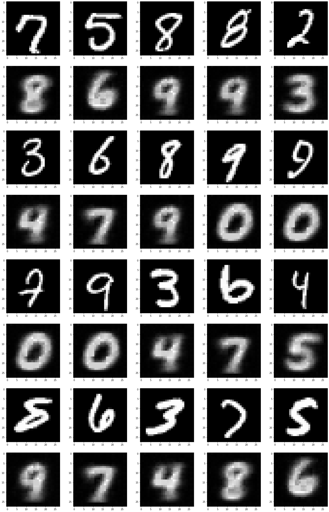
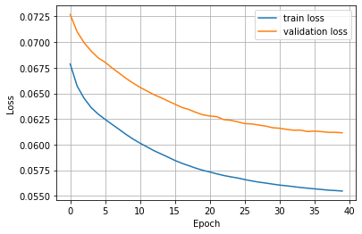

# Autoencoders 

In this problem, you should implement an autoencoder network, which generates an image presenting the next digit of the input digit.

The model should input a batch of images and output the generated images for the whole batch. The final result is: 

 best epoch model into the model object:
 

